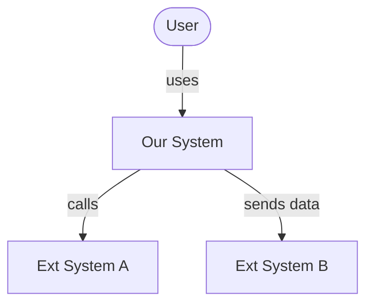
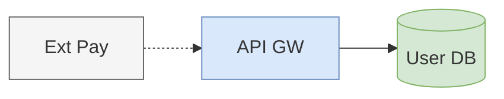
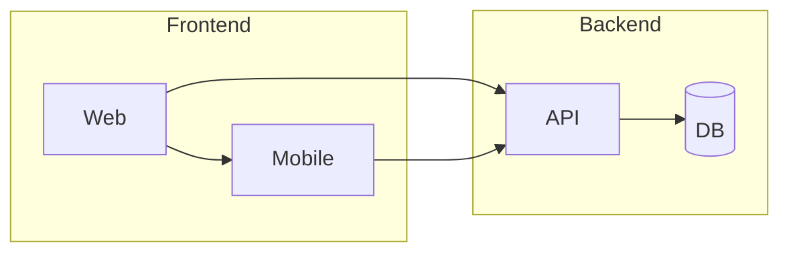
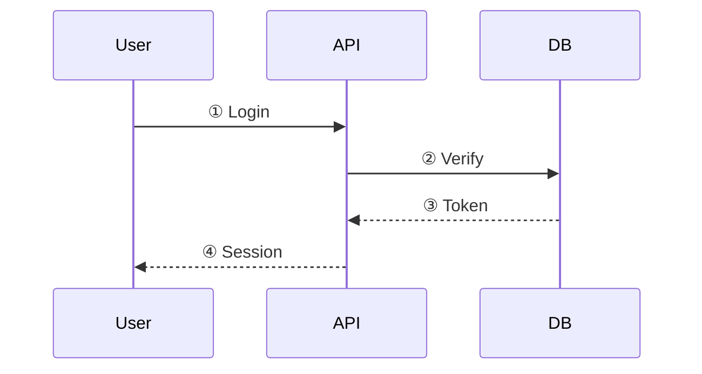

# Diagram Rules — Mermaid Authoring Rules

Mandatory reference when generating Mermaid code in Phase 3.

---

## 1. Node Text Rules

### Keep Short (3-5 words max)
```
✅ A[Auth Svc]
✅ B[(User DB)]
✅ C{Rate > 100?}

❌ A[Authentication and Authorization Service Module]
❌ B[(User Profile and Session Database)]
```

### Handling Long Names
- **Abbreviate**: Authentication → Auth, Management → Mgmt, Service → Svc
- **Line break**: `A["Order<br/>Processor"]` (2 lines max)
- **Numbering**: Use `①`, `②` in shapes, explain below

### Abbreviation Glossary
| Abbr | Full |
|------|------|
| Svc | Service |
| DB | Database |
| MQ | Message Queue |
| LB | Load Balancer |
| GW | Gateway |
| Proc | Processor |
| Mgr | Manager |
| Cfg | Config |

Add project-specific abbreviations to the legend.

---

## 2. C4 Model Application

### Level 1: System Context
- Center: our system (single box)
- Surrounding: users, external systems only
- Max 5 shapes
- Edges: "uses", "sends data to" level



### Level 2: Container
- Decompose the system: web app, API, DB, MQ, etc.
- One shape per deploy unit
- 10-15 shapes
- Edges: annotate protocol/format (REST, gRPC, SQL)

### Level 3: Component
- Modules/classes inside a specific container
- One diagram per container
- 10-15 shapes
- Edges: function calls, event publishing

### No Level Mixing
Never combine L1 elements (external systems) and L3 elements (classes) in one diagram.
To show L3 detail, create a separate diagram that "zooms into" one L2 container.

---

## 3. Edge Rules

### Style Semantics (Consistent)
| Mermaid Syntax | Meaning | Use Case |
|---------------|---------|----------|
| `-->` | Synchronous call/dependency | REST, gRPC, function call |
| `-.->` | Asynchronous message | MQ, event, webhook |
| `==>` | Data flow (bulk) | ETL, batch, stream |
| `--o` | Read-only reference | Query, cache hit |

### Label Rules
- Labels: 2-3 words max: `-->|REST API|`, `-.->|event|`
- Show protocol or data format only
- For longer descriptions, number the edges and explain in text

### Direction Consistency
- Main flow: **left→right** (LR) or **top→bottom** (TB)
- Minimize reverse arrows (omit responses or use dotted lines)
- No mixed directions within a single diagram

---

## 4. Color Rules

### 3-4 Color Palette
| Role | Color | Mermaid style |
|------|-------|---------------|
| Core service | Blue | `fill:#dae8fc,stroke:#6c8ebf` |
| Data store | Green | `fill:#d5e8d4,stroke:#82b366` |
| External system | Gray | `fill:#f5f5f5,stroke:#666666` |
| Highlight/Warning | Orange | `fill:#fff2cc,stroke:#d6b656` |

### Application


### Prohibited
- More than 5 colors
- Different colors for the same role
- Using colors without a legend (legend is mandatory)

---

## 5. Layout Rules

### Direction Selection Criteria
| Diagram Type | Direction | Reason |
|-------------|-----------|--------|
| Data pipeline | LR | Emphasize flow |
| Hierarchy | TB | Top→bottom |
| Sequence/Timeline | TB | Top→bottom time |
| Comparison/Parallel | LR | Left-right symmetry |

### Subgraph Usage
- Use only for logical grouping (2+ nodes)
- Max 1 level of subgraph nesting
- Subgraph titles: 3 words or fewer



---

## 6. Numbering Pattern

For complex flows, number shapes/edges and explain in text:



**Flow description:**
1. ① User sends login request (ID + PW)
2. ② API verifies credentials against DB
3. ③ DB returns JWT token
4. ④ API responds with session cookie

---

## 7. Diagram Type Guide

### Flowchart — System structure, data flow
- `graph LR` or `graph TB`
- Conditional branches: diamond `{}`
- Loops: dotted reverse arrow

### Sequence — API calls, user interactions
- Keep participant aliases short: `participant A as Auth Svc`
- Use alt/opt/loop boxes for branching
- Responses use dotted lines `-->>>`

### Class/ER — Data models
- Show only key fields (PK, FK, main attributes)
- Annotate cardinality on relationship lines: `||--o{`
- Max 3 public methods

### State — State machines
- State names are nouns/adjectives, not verbs: `Idle`, `Processing`, `Failed`
- Transition labels: `event / [guard] / action` format

---

## 8. Legend — Mandatory Rule

Every diagram output must include a legend:

```markdown
### Legend
| Symbol | Meaning |
|--------|---------|
| ── → | Synchronous call (REST) |
| - - → | Asynchronous (MQ) |
| 🔵 | Service |
| 🟢 | Data store |
| ⬜ | External system |
```

A diagram without a legend is a validation failure.
