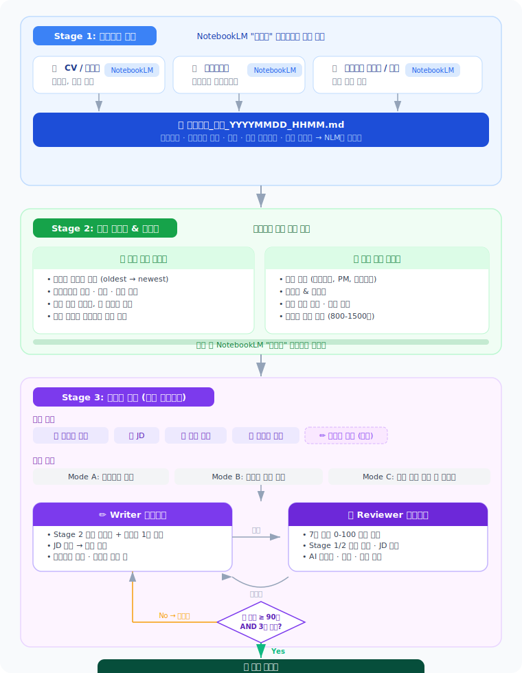

# claude-useful-instructions

나만의 Claude Code 설정 모음. 어느 머신에서든 `./install.sh` 한 번으로 적용됩니다.

## 목차

- [구조](#구조)
- [설치](#설치)
- [Skills (자동 트리거 스킬)](#skills-자동-트리거-스킬)
  - [Agents vs Skills](#agents-vs-skills)
  - [현재 스킬](#현재-스킬)
  - [`data-pipeline-architect`](#data-pipeline-architect)
  - [`diagram-pipeline`](#diagram-pipeline)
  - [스킬 작성법](#스킬-작성법)
- [Agents (서브에이전트)](#agents-서브에이전트)
  - [작성법](#작성법)
  - [네이밍 컨벤션](#네이밍-컨벤션)
- [Rules (공유 규칙)](#rules-공유-규칙)
- [Commands](#commands)
  - [`/cover-letter`](#cover-letter)
  - [`/sync-docs`](#sync-docs)
  - [`/smart-git-commit-push`](#smart-git-commit-push)
- [새 설정 추가](#새-설정-추가)

---

## 구조

```
claude-useful-instructions/
├── agents/
│   ├── vla-*.md              # VLA 프로젝트 서브에이전트
│   ├── cover-letter-writer.md   # 자소서 Writer 에이전트
│   └── cover-letter-reviewer.md # 자소서 Reviewer 에이전트
├── commands/
│   ├── sync-docs.md          # /sync-docs 커맨드
│   ├── smart-git-commit-push.md # /smart-git-commit-push 커맨드
│   └── cover-letter.md       # /cover-letter 자소서 작성 시스템
├── rules/
│   ├── coding-style.md       # 코딩 스타일
│   └── vla-code-standards.md # 공통 코드 표준 (서브에이전트 공유용)
├── skills/
│   ├── data-pipeline-architect/  # 데이터 파이프라인 설계 스킬
│   │   ├── SKILL.md
│   │   └── references/
│   └── diagram-pipeline/         # mermaid → draw.io → docs 파이프라인
│       ├── SKILL.md
│       └── agents/               # extractor / generator / inserter
└── install.sh                # ~/.claude/ 에 설정 복사
```

## 설치

```bash
git clone https://github.com/aanna0701/claude-useful-instructions.git
cd claude-useful-instructions
./install.sh
```

특정 프로젝트에만 설치하려면:

```bash
./install.sh /path/to/project   # → /path/to/project/.claude/ 에 설치
```

---

## Skills (자동 트리거 스킬)

`.claude/skills/`에 폴더 단위로 설치되며, Claude Code가 대화 맥락에 맞춰 **자동으로 트리거**합니다.

### Agents vs Skills

| | Agents | Skills |
|---|--------|--------|
| 트리거 | 메인 Claude가 판단하여 위임 | 대화 주제에 따라 자동 로딩 |
| 범위 | 특정 작업 실행 (코드 수정, 파일 생성) | 지식 + 워크플로우 (설계, 분석, 생성) |
| 구조 | 단일 `.md` 파일 | 폴더 (SKILL.md + references/) |
| 용도 | "이 코드 수정해줘" | "이 구조 설계해줘" |

### 현재 스킬

| 스킬 | 트리거 예시 | 설명 |
|------|------------|------|
| [`data-pipeline-architect`](#data-pipeline-architect) | "데이터 파이프라인 설계해줘" | 8원칙 진단 → 서브에이전트 설계 → instruction 생성 |
| [`diagram-pipeline`](#diagram-pipeline) | "mermaid를 drawio로 변환해줘" | mermaid 추출 → .drawio 생성 → 편집 → docs 삽입 |

---

### `data-pipeline-architect`

데이터 파이프라인 구조 설계 및 서브에이전트 자동 생성 스킬. 자세한 내용은 [`skills/data-pipeline-architect/`](skills/data-pipeline-architect/)를 참고하세요.

```
사용자 데이터 구조 초안
  → Phase 1: 8 불변 원칙 진단
  → Phase 2: 파이프라인 단계 경계 식별
  → Phase 3: 서브에이전트 구조 설계
  → Phase 4: Claude Code instruction 세트 생성
  → Phase 5: 자기 검증 체크리스트
```

---

### `diagram-pipeline`

Markdown 문서의 mermaid 다이어그램을 draw.io로 변환하고, Cursor에서 편집 후 docs에 재삽입하는 end-to-end 파이프라인. 스크립트 없이 Claude 에이전트가 전 과정을 처리합니다.

**편집 환경**: Cursor + [`hediet.vscode-drawio`](https://marketplace.visualstudio.com/items?itemName=hediet.vscode-drawio) 확장

#### 워크플로우

```
Phase 1: extractor 에이전트    Phase 2: generator 에이전트   Phase 3: 사용자 편집    Phase 4: inserter 에이전트
┌─────────────────────────┐   ┌─────────────────────────┐   ┌──────────────────┐   ┌─────────────────────────┐
│ docs/**/*.md 스캔        │   │ .mermaid 파일 읽기        │   │ Cursor에서       │   │ .drawio.svg 확인         │
│   ↓                     │   │   ↓                     │   │ .drawio 열기     │   │   ↓                     │
│ mermaid 블록 추출        │ → │ draw.io XML 생성         │ → │   ↓              │ → │ SVG → docs/assets/ 복사  │
│   ↓                     │   │   ↓                     │   │ 노드/색상 편집    │   │   ↓                     │
│ manifest.json 생성       │   │ .drawio 파일 Write       │   │   ↓              │   │ mermaid → ![img] 교체    │
│ .mermaid 파일 저장       │   │                         │   │ Convert To SVG   │   │ 원본 mermaid 주석 보존   │
└─────────────────────────┘   └─────────────────────────┘   └──────────────────┘   └─────────────────────────┘
```

#### 사용법

```
"mermaid를 drawio로 변환해줘"       → Phase 1+2 자동 실행
"다이어그램 docs에 넣어줘"           → Phase 4 실행
"처음부터 끝까지 다 해줘"            → Phase 1+2 후 사용자에게 Phase 3 안내
```

#### 커밋 가이드

| 파일 | 커밋 | 이유 |
|------|------|------|
| `diagrams/*.drawio` | **Yes** | 편집 가능한 원본 |
| `diagrams/*.drawio.svg` | **Yes** | 편집 가능 + SVG 겸용 |
| `diagrams/*.mermaid` | **Yes** | mermaid 백업 |
| `diagrams/manifest.json` | **Yes** | 라인 추적용 |
| `docs/assets/diagrams/*.drawio.svg` | **Yes** | MkDocs 서빙 산출물 |

---

### 스킬 작성법

```
skills/<skill-name>/
├── SKILL.md              ← 필수. YAML frontmatter (name, description)
├── references/           ← 선택. SKILL.md에서 필요할 때만 로딩
├── scripts/              ← 선택. 실행 가능한 헬퍼
└── assets/               ← 선택. 템플릿, 아이콘 등
```

SKILL.md의 frontmatter `description`이 트리거 판단에 가장 중요합니다:

```yaml
---
name: my-skill
description: >
  이 스킬이 무엇을 하는지, 어떤 요청에 트리거되는지.
  "관련 키워드 1", "관련 키워드 2" 등에 트리거.
---
```

---

## Agents (서브에이전트)

`.claude/agents/`에 마크다운 파일로 정의하면 Claude Code가 자동으로 인식합니다.

### 작성법

```yaml
---
name: agent-name
description: "이 에이전트가 처리하는 작업 설명"
tools: Read, Write, Edit, Bash, Glob, Grep
model: sonnet  # sonnet, opus, haiku 중 선택
---

# Agent 이름

## 담당 영역
- `src/...` — 설명

## 코드 규칙
- 규칙 1
- 규칙 2
```

### 핵심 포인트

- **description**이 가장 중요 — Claude가 이걸 보고 언제 위임할지 결정
- **tools**: 에이전트가 사용할 수 있는 도구 제한
- **model**: 단순 작업은 `haiku`, 복잡한 작업은 `opus`로 비용 최적화
- 프로젝트별 에이전트는 `<project>/.claude/agents/`에, 전역은 `~/.claude/agents/`에 배치

### 네이밍 컨벤션

프로젝트 접두사를 붙여 범위를 명확히 합니다. 패턴: `<project>-<domain>.md`

```
.claude/agents/
├── vla-capture.md   # VLA — 카메라 캡처
├── vla-data.md      # VLA — 데이터 파이프라인
├── vla-model.md     # VLA — 모델 아키텍처
├── vla-train.md     # VLA — 학습
├── vla-eval.md      # VLA — 평가
└── vla-infra.md     # VLA — 인프라
```

---

## Rules (공유 규칙)

`rules/` 디렉토리에 코드 표준 파일을 넣으면 `install.sh`가 `~/.claude/rules/`로 복사합니다.

서브에이전트는 `CLAUDE.md`나 `.claude/rules/`를 자동으로 읽지 않으므로, 에이전트 정의에 반드시 Read 지시를 넣어야 합니다:

```markdown
## 필수 선행 작업
코드를 수정하기 전에 반드시 다음 파일을 Read하라:
1. `CLAUDE.md` — 프로젝트 강제 규칙
2. `.claude/rules/vla-code-standards.md` — 코드 표준
```

### 현재 규칙

| 파일 | 내용 |
|------|------|
| `rules/coding-style.md` | 코딩 스타일 (영어, 불변성, 파일 크기, 에러 처리) |
| `rules/vla-code-standards.md` | pydantic vs dataclass 기준, 불변 패턴, TDD, import 순서 |

---

## Commands

### `/cover-letter`

NotebookLM MCP 기반 한국어 자소서 작성 멀티 에이전트 시스템입니다. **경력직(경력 채용)** 자소서에 최적화된 3단계 파이프라인으로 동작합니다.

#### 파이프라인 구조



#### 💡 추천 워크플로우 (세션 분리)

**Stage 1/2 완료 후 반드시 새 채팅에서 Stage 3를 시작하세요.**

```
채팅 A: /cover-letter  →  Stage 1 (컨텍스트 추출) + Stage 2 (경력 기술서 & 에세이)
                           ↓ NotebookLM에 저장 완료
채팅 B: "자소서 써줘"  →  Stage 3 (자소서 작성 Writer-Reviewer 루프)
```

#### 작성 모드

| 모드 | 설명 |
|------|------|
| **Mode A** | 처음부터 새로 작성 |
| **Mode B** | 사용자가 직접 작성한 초안을 기반으로 개선 |
| **Mode C** | 이전 출력 결과를 사용자가 수정한 버전을 기반으로 개선 |

#### 평가 항목 (7개, 0-100점 연속 척도)

| # | 항목 | 설명 |
|---|------|------|
| 1 | 문법/맞춤법 | 띄어쓰기, 조사, 맞춤법 |
| 2 | 자연스러움 & 전문성 | 문장 흐름, 경력직 전문가 톤 |
| 3 | 사실 검증 | Stage 1/2 문서 기반 AI 자체 대조 |
| 4 | AI 스타일/과장/오버 | AI 투 표현, 과장 문장 탐지 |
| 5 | 항목/경력 적합성 | JD 매칭도, 역량 프레이밍 |
| 6 | 구성/구조 | 기승전결, 도입-맺음말 포괄성 |
| 7 | 글자수 준수 | 제한 내 글자수, 공간 활용률 |

#### 종료 조건

- **정상 종료**: 최소 3회 반복 AND 전 항목 90점 이상
- **정체 종료**: 3회 연속 점수 향상 없음 → 최고 점수 초안으로 제출

#### NotebookLM MCP 설치

```bash
uv tool install notebooklm-mcp-cli   # 설치
nlm login                             # Google 로그인
nlm setup add cursor                  # Cursor에 MCP 등록
nlm doctor                            # 진단
```

**사전 요구사항**: "자소서" 노트북에 이력서/포트폴리오 업로드 완료

```
/cover-letter    # 자소서 작성 시작
```

### `/sync-docs`

프로젝트 문서를 현재 코드베이스 상태에 맞게 자동 갱신합니다.

```
/sync-docs           # 변경된 모든 .md 파일 갱신
/sync-docs README.md # 특정 파일만 갱신
```

### `/smart-git-commit-push`

변경사항을 분석해 기능별로 자동 분리 커밋 후 push합니다.

```
/smart-git-commit-push         # 현재 브랜치에 커밋+푸시
/smart-git-commit-push main    # main 브랜치로 푸시
```

---

## 새 설정 추가

1. `commands/`, `agents/`, `rules/`, 또는 `skills/` 에 파일 추가
2. `git commit && git push`
3. 다른 머신에서 `git pull && ./install.sh`
