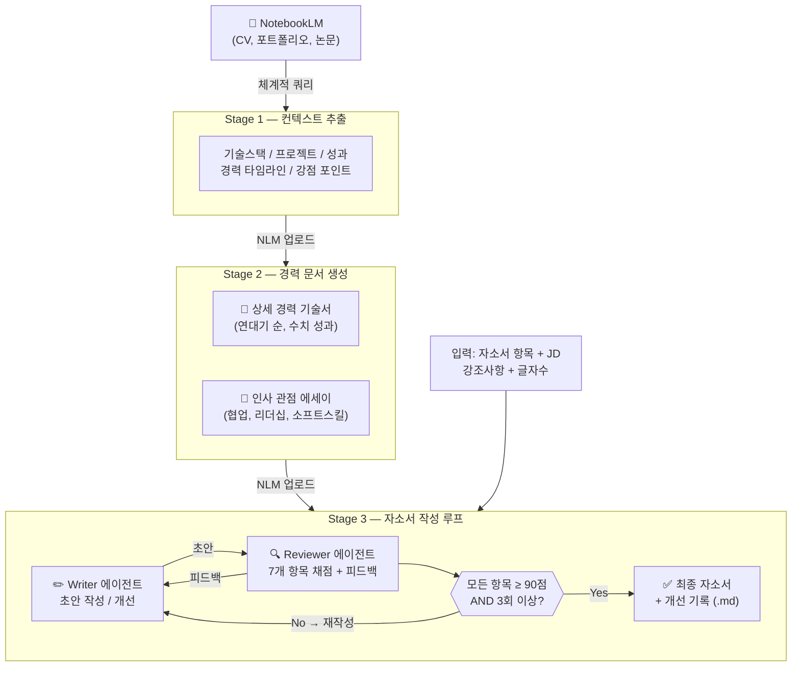

# cover-letter — 자소서 작성 멀티 에이전트 시스템 (3-Stage Pipeline)

NotebookLM MCP 기반 경력직 한국어 자기소개서(자소서) 작성 시스템.
3단계 파이프라인으로 원시 포트폴리오 데이터를 완성도 높은 자소서로 변환한다.

---

## Architecture Overview



---

## Prerequisites

- **NotebookLM MCP** 서버가 연결 및 설정되어 있어야 한다
  - MCP Server: `https://github.com/jacob-bd/notebooklm-mcp-cli`
  - **"자소서"** 이름의 노트북에 다음이 저장되어 있어야 한다:
    - CV / 이력서
    - 포트폴리오
    - 프로젝트 상세 기술서
    - 논문 또는 기술 문서 (있는 경우)

## Stage Entry Points

사용자가 이미 완료한 단계에 따라 진입점을 결정한다:
- **아무것도 없음**: Stage 1부터 시작
- **구조화된 컨텍스트 보유**: Stage 2로 건너뜀
- **경력기술서 + 에세이 보유**: Stage 3으로 바로 진입
- **특정 항목만 작성 원함**: 이전 실행 결과가 있으면 Stage 3 직접 진입

어느 단계에서 시작할지 불명확하면 사용자에게 확인한다.

---

## Guards & Checkpoints

파이프라인 전반에서 아래 가드를 반드시 실행한다. 조건 미충족 시 해당 단계를 진행하지 않고 사용자에게 안내한다.

### G1 — NotebookLM 연결 확인 (Stage 1 시작 전 필수)

Stage 1(또는 전체 파이프라인 시작) 전에 다음을 순서대로 확인한다:

1. NotebookLM MCP 도구가 호출 가능한지 확인
2. `"자소서"` 이름의 노트북이 존재하는지 확인
3. 노트북에 소스(이력서, 포트폴리오 등)가 하나 이상 있는지 확인

조건 미충족 시:
- MCP 미연결 → "NotebookLM MCP가 연결되어 있지 않습니다. `jacob-bd/notebooklm-mcp-cli` MCP를 설정 후 다시 실행해 주세요."
- 노트북 없음 → "NotebookLM에 `자소서` 노트북이 없습니다. 노트북을 만들고 CV/포트폴리오를 추가해 주세요."
- 소스 없음 → "노트북에 소스가 없습니다. 이력서나 포트폴리오를 먼저 업로드해 주세요."

### G2 — Stage 진입 조건 확인

각 Stage 시작 전 전제 조건이 충족됐는지 확인한다.

**Stage 2 진입 전:**
- NotebookLM `자소서` 노트북에 `컨텍스트_정리_*` 소스가 있어야 한다
- 없으면: "Stage 1 컨텍스트 문서가 NotebookLM에 없습니다. Stage 1부터 시작하시겠습니까?"

**Stage 3 진입 전:**
- NotebookLM에 `경력_기술서_*` 및 `인사관점_에세이_*` 소스가 있어야 한다
- 없으면: "Stage 2 경력 문서가 NotebookLM에 없습니다. Stage 2부터 시작하시겠습니까?"

여러 버전이 있으면 가장 최신(타임스탬프 기준)을 기본으로 사용하고, 사용자에게 어떤 버전을 쓸지 확인한다.

### G3 — Stage 3 필수 입력 수집 확인

Stage 3 루프 시작 전, 다음 항목이 모두 확보됐는지 확인한다:

| 항목 | 필수 여부 | 미제공 시 처리 |
|------|-----------|----------------|
| 자소서 항목 (질문/주제) | 필수 | 입력 요청 |
| JD (직무 기술서) | 권장 | "JD 없이는 직무 키워드 매핑이 어렵습니다. JD를 붙여넣으시겠습니까? (없으면 생략 가능)" |
| 글자수 제한 | 선택 | 미제공 시 기본값 500-800자 적용, 사용자에게 안내 |
| 지원 회사/직무명 | 권장 | 미제공 시 "일반 지원용"으로 처리 |

모든 항목 수집 완료 후 루프를 시작한다. 중간에 빠진 항목이 있으면 시작 전에 한 번에 묻는다.

### G4 — 글자수 즉시 검증 (Writer 직후, Reviewer 전)

Writer가 초안을 완성한 직후, Reviewer에게 넘기기 전에 글자수를 카운트한다.

- 줄바꿈 포함 전체 문자 수 계산 (`\n` = 1자)
- 글자수 제한이 있을 때:
  - **초과 시**: Reviewer 호출 없이 Writer에게 즉시 재작성 요청. "현재 [N]자로 제한 [M]자를 [X]자 초과합니다. 글자수 내로 다시 작성하세요."
  - **제한의 80% 미만**: Writer에게 경고. "현재 [N]자로 제한 [M]자의 [%]% 수준입니다. 공간을 더 활용하세요."
  - **80-100%**: 정상, Reviewer로 진행
- 글자수 제한이 없을 때: 500-800자 기준으로 동일하게 적용

### G5 — 사실 날조 방지

Stage 1/2/3 전 단계에서 적용:

- NotebookLM 쿼리로 확인되지 않은 수치, 날짜, 성과를 **절대 지어내지 않는다**
- 정보가 부족하면:
  - Stage 1/2: 해당 항목을 `[확인 필요: 구체적 수치 없음]`으로 마킹하고 사용자에게 확인 요청
  - Stage 3 Writer: 수치 없이 서술하거나, 애매한 표현(`여러 프로젝트`, `다수의 경험`) 사용 — 숫자 조작 금지
  - Stage 3 Reviewer: 사실 검증에서 원본 문서에 없는 수치 발견 시 구체적으로 지적

### G6 — Mode 확인 (초안 제공 시)

사용자가 텍스트를 붙여넣었을 때, 루프 시작 전에 모드를 명시적으로 확인한다:

```
감지된 시나리오: 텍스트 초안이 제공되었습니다.
- Mode B (새 초안 개선): 직접 작성한 초안으로 처음부터 개선
- Mode C (이전 결과 수정): 이전에 에이전트가 생성한 자소서를 수정한 버전

어떤 모드로 진행할까요?
```

Mode C 확인 후 → best_draft = 사용자 수정본으로 설정, 루프 리셋.
이전 대화에서 생성된 자소서와 유사한 텍스트이면 Mode C로 자동 감지하되, 사용자에게 확인은 받는다.

---

## Stage 1: Context Extraction (컨텍스트 추출)

**목표:** NotebookLM 노트북의 모든 자소서 관련 정보를 구조화된 참조 문서로 추출한다.

### Step 1.1: NotebookLM 체계적 쿼리

"자소서" 노트북에 다음 항목별 타겟 쿼리를 실행한다:

1. **기술 스택 & 도구** — 언어, 프레임워크, 플랫폼, 방법론, 자격증
2. **프로젝트 경험** — 각 프로젝트별: 이름, 기간, 팀 규모, 역할, 기술, 핵심 과제, 수치 성과
3. **직무 성과** — 수치화된 결과(%, 배, 건, 원), 수상, 논문, 임팩트 규모
4. **경력 타임라인** — 회사, 직책, 기간 순서로 정리, 승진/scope 확장 포함
5. **강점 포인트** — 기술 깊이, 리더십/멘토링, 협업, 문제해결 패턴, 도메인 전문성
6. **학력 & 연구** — 학위, 논문 주제, 핵심 발견, 실무 관련성 (해당 시)

### Step 1.2: 구조화 문서 작성

```markdown
# 자소서 컨텍스트 정리

## 1. 기술 스택
## 2. 프로젝트 경험
### 프로젝트 1: [이름]
- 기간: / 팀 규모: / 역할:
- 기술:
- 핵심 과제:
- 성과 (수치):
## 3. 직무 성과
## 4. 경력 타임라인
## 5. 강점 포인트
### 기술적 강점 / 리더십 & 협업 / 문제 해결 패턴 / 도메인 전문성
## 6. 학력 & 연구
```

### Step 1.3: 저장 및 NotebookLM 업로드

파일명: `컨텍스트_정리_[timestamp].md`

사용자 확인 후 NotebookLM "자소서" 노트북에 소스로 추가한다:
- 타이틀 형식: `컨텍스트_정리_YYYYMMDD_HHMM`

---

## Stage 2: Career Description & Essay (경력 기술서 & 에세이)

**목표:** 구조화된 컨텍스트를 자소서 작성의 토대가 되는 두 개의 서술 문서로 변환한다.

### Step 2.1: 상세 경력 기술서 작성

오래된 순서(oldest → newest)로 경력/학력을 정리한 **연대기식 경력 기술서** 작성.

```markdown
### [회사명] — [직책] (YYYY.MM ~ YYYY.MM)
[역할 범위 2-3문장 개요]
**주요 프로젝트 및 성과:**
- [프로젝트명]: [구체적 기여와 수치화된 성과]
**핵심 역량:** [이 경력에서 입증된 역량 키워드]
```

작성 규칙:
- 모든 주장은 Stage 1 컨텍스트로 추적 가능해야 함 — 조작 금지
- 정확한 수치 사용: "매출 15% 증가" not "매출 증가에 기여"
- 팀 성과가 아닌 본인의 구체적 기여 서술
- 기술 깊이를 보여주는 세부 정보 포함

### Step 2.2: 인사 관점 에세이 작성

인사(HR) 관점에서 소프트스킬과 협업에 집중한 **에세이** 작성 (800-1500자).

다루어야 할 주제:
- 협업 경험 (디자이너, PM, 비즈니스 등 cross-functional)
- 리더십 & 멘토링
- 커뮤니케이션 (기술/비기술 이해관계자 연결)
- 문제 해결 접근법 (데이터 기반, 사용자 중심 등)
- 조직 기여 (문화, 프로세스 개선, 지식 공유)
- 갈등 해결

작성 규칙:
- 불릿 포인트 아닌 에세이 형식(산문)
- 모든 주장을 Stage 1 컨텍스트의 구체적 일화로 뒷받침
- 단발 사건이 아닌 여러 경험의 패턴에 집중

### Step 2.3: 저장 및 NotebookLM 업로드

파일명:
- `상세_경력_기술서_[timestamp].md`
- `인사관점_에세이_[timestamp].md`

사용자 확인 후 각각 NotebookLM에 업로드:
- 타이틀 형식: `경력_기술서_YYYYMMDD_HHMM`, `인사관점_에세이_YYYYMMDD_HHMM`

---

## Stage 3: Cover Letter Writing (자소서 작성)

**목표:** 경력 기술서와 에세이를 소스로 삼아 특정 지원서에 맞는 완성도 높은 자소서를 작성한다.

### Step 3.0: 사용자 입력 수집

1. **자소서 항목**: 지원서의 정확한 질문/주제
2. **JD (Job Description)**: 직무 기술서 — 주요 책임, 필요 기술, 우대 조건
3. **강조 사항**: 강조하고 싶은 경험, 기술, 특성
4. **글자수 제한**: 줄바꿈 포함 HARD limit. 없으면 500-800자 기본값
5. **지원 회사/직무**
6. **사용자 초안 (선택)**: 사용자가 직접 쓴 초안 또는 이전 결과물 수정본

### Step 3.0.1: 작성 모드 결정

**Mode A: 처음부터 작성 (기본)**
- 항목 + JD + 강조사항만 제공, 초안 없음
- Writer가 Stage 2 문서 기반으로 첫 초안 작성

**Mode B: 사용자 초안 개선**
- 사용자가 직접 쓴 초안 제공
- Writer의 0차 작성 생략 — 사용자 초안이 첫 번째 draft
- Reviewer가 먼저 평가 → Writer가 피드백 기반으로 개선
- 사용자의 의도, 구조 선택, 핵심 표현 반드시 보존

**Mode C: 이전 결과물 수정 후 재요청**
- 이전에 생성한 자소서를 사용자가 편집해서 다시 제출
- 사용자 수정본을 새로운 best_draft로 설정 — 루프 리셋
- 사용자의 편집은 의도적인 선택 — Reviewer가 품질 문제를 구체적으로 지적하지 않는 한 되돌리지 않음

**모드 감지:**
- "이거 수정/개선해줘" + 텍스트 제공 → Mode B 또는 C
- 이전 출력과 유사한 텍스트 → Mode C
- 텍스트 없음 → Mode A

### Step 3.1: Writer 에이전트 — 초안 작성

**cover-letter-writer** 에이전트에게 위임한다.

전달할 정보:
- 자소서 항목, JD, 강조 사항
- Stage 2 경력 기술서 + 인사관점 에세이 (1차 소스)
- 글자수 제한
- (2회차 이후) Reviewer 피드백
- (Mode B/C) 사용자 초안

Writer 에이전트의 핵심 역할:
- Stage 2 문서를 1차 소스로 사용, 필요 시 NotebookLM 추가 쿼리
- JD 분석 → 사용자 경험을 직무 요건에 매핑
- **기승전결 구조** 필수 — 경험 나열이 아닌 하나의 이야기
- 경력직 전문가 톤 유지 (정확한 전문 용어, 수치 기반 임팩트)
- 글자수 제한 엄수

---

### Step 3.2: Reviewer 에이전트 — 초안 평가

**cover-letter-reviewer** 에이전트에게 위임한다.

전달할 정보:
- 자소서 항목, JD, 강조 사항
- Writer의 초안
- Stage 1 컨텍스트 + Stage 2 문서 (사실 검증용)
- 글자수 제한
- (2회차 이후) 이전 피드백

Reviewer 에이전트의 7가지 평가 항목:
1. 문법/맞춤법
2. 자연스러움 & 전문성
3. 사실 검증 (Stage 1/2 문서 대조)
4. AI 스타일 탈피 & 과장/오버 표현
5. 항목 적합성 & 경력 적합성 (JD 매핑 포함)
6. 구성/구조 & 스토리라인 (기승전결)
7. 글자수 준수

각 항목 0-100 연속 점수 → 총점 = 7개 평균.

---

## Step 3.3: 반복 개선 루프

```
iteration = 0
best_score = 0
best_draft = null
best_iteration = 0
no_improve_streak = 0

# Mode B/C: 사용자 초안을 시작점으로 설정
IF user_draft_provided:
    current_draft = user_draft
    best_draft = user_draft

WHILE iteration < 10:
    IF iteration == 0:
        IF user_draft_provided:
            # Mode B/C: Writer 건너뜀, 사용자 초안 바로 Reviewer 평가
            pass
        ELSE:
            # Mode A: Writer가 Stage 2 문서로 첫 초안 작성
            Writer writes first draft
    ELSE:
        IF total_score < best_score:
            Writer가 best_draft를 베이스로 Reviewer 피드백 적용
        ELSE:
            Writer가 현재 버전 기반으로 피드백 반영 재작성
    Reviewer가 초안 평가 (각 항목 0-100 연속 점수, e.g. 37, 68, 83, 92)
    dimension_scores = [7개 항목 각 점수]
    total_score = dimension_scores 평균
    min_dimension_score = dimension_scores 중 최솟값
    IF total_score > best_score:
        best_score = total_score
        best_draft = 현재 초안
        best_iteration = iteration
        no_improve_streak = 0
    ELSE:
        no_improve_streak += 1
    개선 기록에 이터레이션 로그
    iteration += 1
    IF iteration >= 3 AND min_dimension_score >= 90:
        BREAK   # 목표 달성
    IF no_improve_streak >= 3:
        BREAK   # 정체 — 3회 연속 개선 없음
```

**종료 조건 1** = 3회 이상 AND **모든 항목 개별 점수 ≥ 90**.
**종료 조건 2** = **3회 연속 개선 없음 (정체)**.
**최대 10회**. 조건 미달 시 best_draft를 남은 피드백과 함께 제시.

---

## Step 3.4: 개선 기록 생성

파일명: `자소서_개선기록_[항목요약]_[timestamp].md`

```markdown
# 자소서 개선 기록

## 기본 정보
- 자소서 항목: [항목]
- 지원 회사/직무: [회사/직무]
- 강조 사항: [강조 사항]
- 글자수 제한: [제한] (없으면 "없음")
- 작성 모드: [A: 처음부터 작성 / B: 사용자 초안 개선 / C: 이전 결과 수정 후 재작성]
- 최종 점수: [총점]/100
- 최고 점수 기록 회차: [N]차 ([점수]/100)
- 총 반복 횟수: [N]회
- 종료 사유: [목표 달성 / 정체 / 최대 반복]

---

## 1차 작성 (초기 평가)

### 초안 (작성자: [Writer / 사용자])
[자소서 전문]

### Reviewer 평가

| 평가 항목 | 점수 | 등급 |
|-----------|------|------|
| 문법/맞춤법 | [0-100] | [등급] |
| 자연스러움 & 전문성 | [0-100] | [등급] |
| 사실 검증 | [0-100] | [등급] |
| AI 스타일/과장/오버 | [0-100] | [등급] |
| 항목/경력 적합성 | [0-100] | [등급] |
| 구성/구조 | [0-100] | [등급] |
| 글자수 준수 | [0-100] | [등급] ([현재]자/[제한]자) |
| **총점** | **[평균]/100** | **[종합 등급]** |

#### 세부 피드백
[각 항목별 피드백]

---

## 2차 작성
- 기반 버전: [N차 (최고 점수)] 또는 [이전 버전 유지]
(동일 구조 반복)

---

## 최종 자소서
- 최고 점수 회차: [N]차 ([점수]/100)
[최종 자소서 전문]
```

---

## Step 3.5: 결과 제시

사용자에게 다음을 전달한다:
1. **최종 자소서** 전문
2. **개선 기록** `.md` 파일
3. 프로세스 요약 (반복 횟수, 최종 점수, 종료 사유, 주요 개선 사항)

---

## 핵심 규칙

### 언어 규칙
- 자소서, 경력 기술서, 에세이, 컨텍스트 정리 등 사용자 대면 출력은 반드시 **한국어(한글)**
- Reviewer 피드백은 한국어로 작성

### 경력직(경력직) 기본값
- 모든 출력은 사용자가 경력직 전문가임을 전제
- 정확한 전문 용어, 수치 기반 임팩트, 조용한 자신감
- 신입 패턴 금지: "열심히 하겠습니다", "배우고 싶습니다", "성장하고 싶습니다"

### 글자수 엄수
글자수 제한이 있을 때:
- 한글, 공백, 구두점, 줄바꿈 모두 카운트 (줄바꿈 = 1자)
- HARD limit — 1자라도 초과하면 불가

### 기승전결 구조 필수 (Stage 3)
- **기**: 모든 경험을 포괄하는 우산 역할의 오프닝
- **승**: 구체적 경험 전개. 여러 경험이면 [소제목] 사용 (3-5단어, 최대 3개)
- **전**: 경험들을 하나로 묶는 진짜 성찰
- **결**: 모든 경험을 합산한 메시지로 이 회사/역할과 연결

### NotebookLM 사용
- Stage 1: 원시 추출을 위한 집중 쿼리
- Stage 2/3: Stage 1 구조화 결과를 1차 소스로 사용, 필요 시 추가 쿼리
- 정보 부족 시 지어내지 말고 사용자에게 확인
