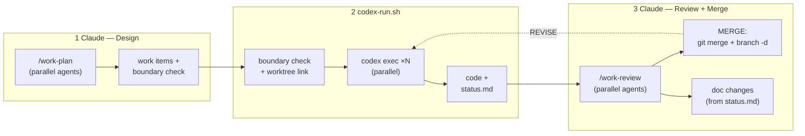

# Claude-Codex Collaboration Workflow

> **Doc type**: Explanation + Tutorial | **Audience**: Developers setting up multi-agent workflows

The `collab` bundle enables structured handoff between **Claude** (design/review) and **Codex** (implementation).

---

## Roles & Work Item Files

| Agent | Role | Writes |
|-------|------|--------|
| **Claude** | spec owner, integrator, final authority | brief.md, contract.md (signed), checklist.md, review.md |
| **Codex** | implementer farm | code, status.md |

## 2-Touch Workflow

Human intervention is minimized to exactly **2 points**:

```
Claude: /work-plan topic1, topic2, topic3
  → parallel agent generation + boundary check + dispatch manifest
                                          ↓
TOUCH 1 — Human: bash codex-run.sh FEAT-001 FEAT-002 FEAT-003
  → auto: boundary check → link worktrees → parallel codex exec → monitor
  → Codex implements per contract, records doc changes in status.md
  → prints: /work-review FEAT-001 FEAT-002 FEAT-003
                                          ↓
TOUCH 2 — Human: /work-review FEAT-001 FEAT-002 FEAT-003
  → Claude reviews in parallel, handles doc changes
  → MERGE: asks confirm → git merge + delete branch
  → REVISE: writes `review.md` MUST-fix items + re-runs `codex-run.sh`, which injects `review.md` into the next Codex prompt
```

## Architecture



---

## Setup

### Step 1: Install collab bundle

```bash
./install.sh --collab /path/to/project
```

This installs everything: `.claude/` artifacts, `AGENTS.md`, `CLAUDE.md`, `codex-run.sh`. Creates `work/items/` directory.

### Installed Layout

```
project/
├── AGENTS.md                          # Codex reads this
├── CLAUDE.md                          # Claude reads this
├── codex-run.sh                       # Codex runner (single + parallel + boundary check)
├── work/items/                        # Work items (created by install.sh)
├── work/dispatch.json                 # Parallel dispatch manifest (created by /work-plan)
└── .claude/
    ├── rules/collab-workflow.md       # Auto-loaded 2-agent rules
    ├── commands/work-{plan,review,impl,revise,status}.md
    ├── agents/{issue-creator,work-reviser}.md
    ├── skills/collab-workflow/
    └── templates/work-item/*.md       # Brief, contract, checklist, status, review
```

The `post-checkout` hook is also installed to `.git/hooks/`, auto-linking `work/` when switching branches in new worktrees.

---

## Worktree Support

`/work-plan` auto-creates a **FEAT-based worktree** per work item:

```
workspace/
├── VasIntelli-research/                    ← main repo (working_parent)
│   └── work/items/FEAT-001-slug/           ← work items live here
├── VasIntelli-research-FEAT-001-slug/      ← auto-created worktree
└── VasIntelli-research-FEAT-002-slug/      ← auto-created worktree
```

### How it works

- `/work-plan` creates branch + worktree per FEAT, records path in `status.md`
- `codex-run.sh` and `/work-impl` resolve worktree from `status.md` Worktree Path
- On MERGE, `/work-review` runs `git worktree remove` + `git branch -d`
- Each worktree is temporary — exists only for the FEAT's lifetime

---

## Parallel Codex Execution

`/work-plan` natively supports multiple topics — they are planned in parallel using concurrent agents, and the system automatically validates that their boundaries don't conflict.

### How it works

1. **Batch planning**: Pass multiple topics to `/work-plan` → each gets its own FEAT item, generated in parallel
2. **Boundary check**: After contracts are generated, the system checks that "Allowed Modifications" paths don't overlap between any pair of items
3. **Dispatch grouping**: Items with no boundary overlap are grouped for parallel execution; conflicting items are placed in sequential groups
4. **Dispatch manifest**: `work/dispatch.json` records parallel groups, dependencies, and conflicts

### Boundary matrix example

```
Boundary Check
──────────────────────────────────────────────
          FEAT-001    FEAT-002    FEAT-003
FEAT-001     —           ✓           ✓
FEAT-002     ✓           —           ⚠ OVERLAP
FEAT-003     ✓           ⚠ OVERLAP   —

⚠ FEAT-002 × FEAT-003: both modify src/utils/logger.py
```

Items with overlaps must run sequentially. The dispatch script enforces this automatically.

### Parallel execution with worktrees

Each Codex instance runs in its own terminal. With worktrees, each can also use its own worktree branch:

```bash
# Terminal 1 (VasIntelli-Training):
bash codex-run.sh FEAT-001

# Terminal 2 (VasIntelli-Inference):
bash codex-run.sh FEAT-002

# Terminal 3 (after 1 & 2 complete — boundary overlap):
bash codex-run.sh FEAT-003
```

---

## Walkthrough: JWT Authentication Middleware

> Follow this end-to-end example to understand the full workflow.

### Phase 1 — Design (Claude)

```
[Claude] /work-plan "Add JWT authentication middleware"

Claude: reviews scope → generates contract → signs (status: draft → signed)

Created work/items/FEAT-001-jwt-auth-middleware/
  brief.md, contract.md (signed), checklist.md, status.md (open)

Codex Command: bash codex-run.sh FEAT-001
```

### Phase 2 — Implement (Codex)

```
[Codex] bash codex-run.sh FEAT-001
  → Reads brief → contract → checklist
  → Updates status.md (in-progress)
  → Implements within contract boundaries (src/middleware/, tests/middleware/)
  → Commits: feat(FEAT-001): add JWT validation middleware
  → Updates status.md → done (5/5 checklist items)
```

### Phase 3 — Review + Merge (Claude)

```
[Claude] /work-review FEAT-001

Claude:
  → review.md: MERGE
  → asks user to confirm → git merge + delete branch
  → applies doc changes from status.md
```

Decision flow:
- **MERGE** → ask user → `git merge feat/FEAT-NNN-*` → `git branch -d feat/FEAT-NNN-*` → apply doc changes → done
- **REVISE** → write concrete `MUST-fix` items to `review.md` + `bash codex-run.sh FEAT-NNN` → `codex-run.sh` injects `review.md` into the prompt → Codex fixes those items first → re-review
- **REJECT** → close work item with reason

---

See `rules/collab-workflow.md` for the compact command table.
