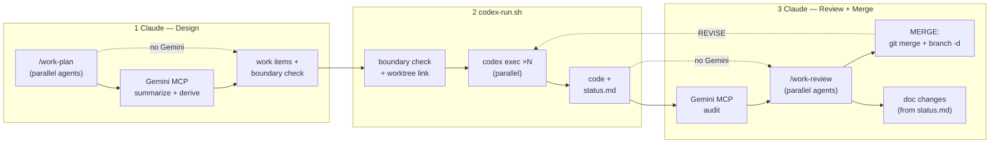

# Claude-Codex-Gemini Collaboration Workflow

> **Doc type**: Explanation + Tutorial | **Audience**: Developers setting up multi-agent workflows

The `collab` bundle enables structured handoff between **Claude** (design/review), **Codex** (implementation), and **Gemini** (audit/synthesis via MCP).

---

## Roles & Work Item Files

| Agent | Role | Writes |
|-------|------|--------|
| **Claude** | spec owner, integrator, final authority | brief.md, contract.md (signed), checklist.md, review.md |
| **Codex** | implementer farm | code, status.md |
| **Gemini** | auditor, synthesizer, spec normalizer | review-gemini.md, contract.md (draft) |

## 2-Touch Workflow

Human intervention is minimized to exactly **2 points**:

```
Claude: /work-plan topic1, topic2, topic3
  → parallel agent generation + boundary check + dispatch manifest
                                          ↓
TOUCH 1 — Human: bash codex-run.sh FEAT-001 FEAT-002 FEAT-003
  → auto: boundary check → link worktrees → parallel codex exec → monitor
  → Codex implements per contract, records doc changes in status.md
  → prints: /work-review FEAT-001 FEAT-002 FEAT-003
                                          ↓
TOUCH 2 — Human: /work-review FEAT-001 FEAT-002 FEAT-003
  → Claude reviews in parallel, handles doc changes
  → MERGE: asks confirm → git merge + delete branch
  → REVISE: outputs fix items + codex-run.sh command
```

## Architecture



---

## Setup

### Step 1: Install collab bundle

```bash
./install.sh --collab /path/to/project
```

This installs everything: `.claude/` artifacts, `AGENTS.md`, `CLAUDE.md`, scripts (`codex-run.sh`, `link-work.sh`), and the Gemini MCP server. Creates `work/items/` directory.

### Step 2: Set up Gemini MCP (optional)

```bash
# 1. Get a Gemini API key → https://aistudio.google.com/apikey
# 2. Set environment variable (add to ~/.bashrc or ~/.zshrc)
export GEMINI_API_KEY='your-api-key-here'

# 3. Run setup (installs deps, auto-registers MCP config)
bash gemini-setup.sh /path/to/project
```

The script automatically registers the MCP server and permissions in `.claude/settings.local.json`. If `gemini-review` is already registered, the step is skipped.

Override the model with `GEMINI_MODEL` (default: `gemini-2.5-flash`):
```bash
export GEMINI_MODEL='gemini-2.5-pro'  # deeper reasoning
```

### Step 3: Set up worktree links (if using git worktrees)

See [Worktree Support](#worktree-support) for `link-work.sh` commands.

### Installed Layout

```
project/
├── AGENTS.md                          # Codex reads this
├── CLAUDE.md                          # Claude reads this
├── codex-run.sh                       # Codex runner (single + parallel + boundary check)
├── gemini-setup.sh                    # Gemini MCP setup script
├── link-work.sh                       # Worktree symlink manager
├── mcp/gemini-review/                 # Gemini MCP server
│   ├── server.py                      #   5 tools wrapping Gemini API
│   ├── prompts.py                     #   System prompts per tool
│   └── pyproject.toml                 #   Dependencies (mcp, google-generativeai)
├── work/items/                        # Shared workspace (created by install.sh)
├── work/dispatch.json                 # Parallel dispatch manifest (created by /work-plan)
└── .claude/
    ├── rules/collab-workflow.md       # Auto-loaded 3-agent rules
    ├── commands/work-{plan,review,status}.md
    ├── skills/collab-workflow/
    └── templates/work-item/*.md       # Brief, contract, checklist, status, review, review-gemini
```

The `post-checkout` hook is also installed to `.git/hooks/`, auto-linking `work/` when switching branches in new worktrees.

---

## Worktree Support

When a repo uses **git worktrees** for feature isolation, each worktree maps to a collaboration role:

```
workspace/
├── Project-Docs       (feature-docs)          ← Claude plans here
│   └── work/items/FEAT-NNN-slug/              ← source of truth (real directory)
├── Project-Training   (feature-training)       ← Codex implements here
│   └── work/ → ../Project-Docs/work (symlink) ← reads plans via symlink
├── Project-Inference  (feature-inference)
└── Project-UI         (feature-ui)
```

### How it works

- The **docs worktree** owns `work/items/` as a real, git-tracked directory
- All other worktrees get `work/` as a **symlink** pointing to the docs worktree
- Symlinks are auto-added to `.gitignore` — never committed to feature branches
- When Claude updates a plan in Docs, Codex sees the change immediately in Training
- Codex commits directly on its worktree branch — no sub-branches needed

### link-work.sh commands

| Command | Description |
|---------|-------------|
| `link-work.sh` | Link `work/` to all worktrees |
| `link-work.sh <filter>` | Link to matching worktree (partial match) |
| `link-work.sh --status` | Show link status across all worktrees |
| `link-work.sh --clean` | Remove all `work/` symlinks |
| `link-work.sh --init <name> <branch>` | Create new worktree + link + gitignore |
| `link-work.sh --self-install` | Install as `git work-link` alias |

> The `post-checkout` hook auto-links on subsequent branch switches.

---

## Parallel Codex Execution

`/work-plan` natively supports multiple topics — they are planned in parallel using concurrent agents, and the system automatically validates that their boundaries don't conflict.

### How it works

1. **Batch planning**: Pass multiple topics to `/work-plan` → each gets its own FEAT item, generated in parallel
2. **Boundary check**: After contracts are generated, the system checks that "Allowed Modifications" paths don't overlap between any pair of items
3. **Dispatch grouping**: Items with no boundary overlap are grouped for parallel execution; conflicting items are placed in sequential groups
4. **Dispatch manifest**: `work/dispatch.json` records parallel groups, dependencies, and conflicts

### Boundary matrix example

```
Boundary Check
──────────────────────────────────────────────
          FEAT-001    FEAT-002    FEAT-003
FEAT-001     —           ✓           ✓
FEAT-002     ✓           —           ⚠ OVERLAP
FEAT-003     ✓           ⚠ OVERLAP   —

⚠ FEAT-002 × FEAT-003: both modify src/utils/logger.py
```

Items with overlaps must run sequentially. The dispatch script enforces this automatically.

### Parallel execution with worktrees

Each Codex instance runs in its own terminal. With worktrees, each can also use its own worktree branch:

```bash
# Terminal 1 (VasIntelli-Training):
bash codex-run.sh FEAT-001

# Terminal 2 (VasIntelli-Inference):
bash codex-run.sh FEAT-002

# Terminal 3 (after 1 & 2 complete — boundary overlap):
bash codex-run.sh FEAT-003
```

---

## Gemini MCP Tools

| Tool | Insertion Point | Purpose |
|------|----------------|---------|
| `gemini_summarize_design_pack` | Before /work-plan | Compress RFC/ADR bundle into implementation-ready summary |
| `gemini_derive_contract` | During /work-plan | Generate contract.md draft from design summary |
| `gemini_audit_implementation` | Before /work-review | Neutral third-party compliance audit |
| `gemini_compare_diffs` | Before integration | Cross-compare parallel branch diffs |
| `gemini_draft_release_notes` | After merge | Generate release notes with migration steps |
| `gemini_polish_career_doc` | After career-docs-writer refinement | Polish career docs for natural, authentic tone |

---

## Walkthrough: JWT Authentication Middleware

> Follow this end-to-end example to understand the full workflow.

### Phase 1 — Design (Claude + Gemini)

```
[Claude] /work-plan "Add JWT authentication middleware"

Gemini: summarize_design_pack(["docs/rfc/RFC-012.md", "docs/adr/ADR-005.md"])
  → Implementation-ready summary

Gemini: derive_contract(summary, scope, boundaries)
  → contract.md draft (status: draft)

Claude: reviews + signs contract (status: draft → signed)

Created work/items/FEAT-001-jwt-auth-middleware/
  brief.md, contract.md (signed), checklist.md, status.md (open)

Codex Command: bash codex-run.sh FEAT-001
```

### Phase 2 — Implement (Codex)

```
[Codex] bash codex-run.sh FEAT-001
  → Reads brief → contract → checklist
  → Updates status.md (in-progress)
  → Implements within contract boundaries (src/middleware/, tests/middleware/)
  → Commits: feat(FEAT-001): add JWT validation middleware
  → Updates status.md → done (5/5 checklist items)
```

### Phase 3 — Review + Merge (Gemini + Claude)

```
[Claude] /work-review FEAT-001

Gemini: audit_implementation(contract, changed_files, checklist)
  → review-gemini.md: 5/5 Pass, no boundary violations

Claude (informed by Gemini audit):
  → review.md: MERGE
  → asks user to confirm → git merge + delete branch
  → applies doc changes from status.md
```

Decision flow:
- **MERGE** → ask user → `git merge feat/FEAT-NNN-*` → `git branch -d feat/FEAT-NNN-*` → apply doc changes → done
- **REVISE** → output fix items + `bash codex-run.sh FEAT-NNN` → Codex fixes → re-review
- **REJECT** → close work item with reason

---

## Quick Reference

| Command/Tool | Actor | Description |
|-------------|-------|-------------|
| `/work-plan [topic(s)]` | Claude | Create work item(s) with boundary check |
| `/work-status [FEAT-NNN]` | Claude | Check progress |
| `/work-review [FEAT-NNN]` | Claude | Review implementation against contract |
| `codex-run.sh FEAT-IDs` | User | Boundary check + parallel dispatch |
| `codex-run.sh --check` | User | Boundary overlap check only (dry run) |
| `codex-run.sh --from-manifest` | User | Dispatch from manifest (respects parallel groups) |
| `codex-run.sh --status` | User | Show all open work items |
| `link-work.sh` | User | Manage work/ symlinks (see [commands](#link-worksh-commands)) |
| `gemini_*` tools | Gemini (MCP) | See [Gemini MCP Tools](#gemini-mcp-tools) |
