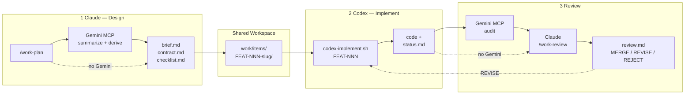
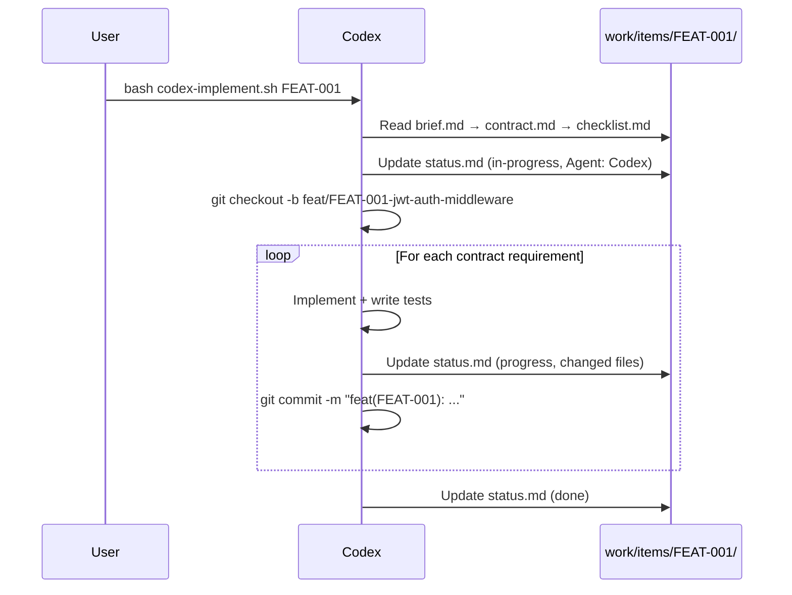
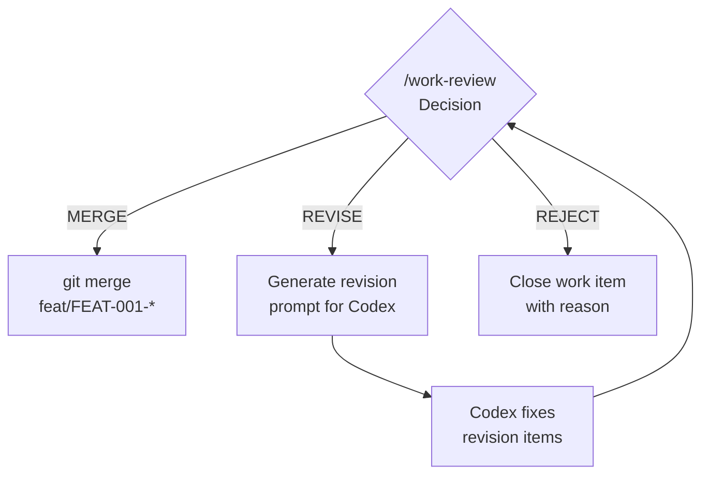

# Claude-Codex-Gemini Collaboration Workflow

> **Doc type**: Explanation + Tutorial | **Audience**: Developers setting up multi-agent workflows

The `collab` bundle enables structured handoff between **Claude** (design/review), **Codex** (implementation), and **Gemini** (audit/synthesis via MCP).

---

## Roles

| Agent | Role | Writes |
|-------|------|--------|
| **Claude** | spec owner, integrator, final authority | brief, contract (signed), review.md |
| **Codex** | implementer farm | code, status.md |
| **Gemini** | auditor, synthesizer, spec normalizer | review-gemini.md, contract (draft) |

## Architecture



---

## Setup

### Step 1: Install collab bundle

```bash
./install.sh --collab /path/to/project
```

This copies all Claude-side artifacts (rules, commands, skills, templates) to `.claude/`, places `AGENTS.md`, `CLAUDE.md`, scripts, and the Gemini MCP server at the project root.

### Step 2: Set up Codex

```bash
bash codex-setup.sh /path/to/project
```

Places `AGENTS.md` + `codex-implement.sh` at project root. Creates `work/items/` directory. Run this once per project.

### Step 3: Set up Gemini MCP (optional)

```bash
# 1. Get a Gemini API key
#    → https://aistudio.google.com/apikey

# 2. Set environment variable
export GEMINI_API_KEY='your-api-key-here'

# 3. Run setup (installs deps, prints config)
bash gemini-setup.sh /path/to/project
```

The setup script prints a JSON snippet to add to Claude Code settings. Add it to either:
- **Project-level**: `/path/to/project/.claude/settings.local.json`
- **Global**: `~/.claude/settings.json`

```json
{
  "mcpServers": {
    "gemini-review": {
      "command": "uv",
      "args": ["run", "--directory", "/path/to/project/mcp/gemini-review", "python", "server.py"],
      "env": { "GEMINI_API_KEY": "${GEMINI_API_KEY}" }
    }
  },
  "permissions": {
    "allow": [
      "mcp__gemini_review__gemini_summarize_design_pack",
      "mcp__gemini_review__gemini_derive_contract",
      "mcp__gemini_review__gemini_audit_implementation",
      "mcp__gemini_review__gemini_compare_diffs",
      "mcp__gemini_review__gemini_draft_release_notes"
    ]
  }
}
```

Override the model with `GEMINI_MODEL` (default: `gemini-2.5-pro`):
```bash
export GEMINI_MODEL='gemini-2.5-flash'  # cheaper, faster
```

### Installed Layout

```
project/
├── AGENTS.md                          # Codex reads this
├── CLAUDE.md                          # Claude reads this
├── codex-implement.sh                 # Codex entry point
├── codex-setup.sh                     # Codex setup script
├── gemini-setup.sh                    # Gemini MCP setup script
├── mcp/gemini-review/                 # Gemini MCP server
│   ├── server.py                      #   5 tools wrapping Gemini API
│   ├── prompts.py                     #   System prompts per tool
│   └── pyproject.toml                 #   Dependencies (mcp, google-generativeai)
├── work/items/                        # Shared workspace (created by codex-setup.sh)
└── .claude/
    ├── rules/collab-workflow.md       # Auto-loaded 3-agent rules
    ├── commands/work-{plan,review,status}.md
    ├── skills/collab-workflow/
    └── templates/work-item/*.md       # Brief, contract, checklist, status, review, review-gemini
```

---

## Gemini MCP Tools

| Tool | Insertion Point | Purpose |
|------|----------------|---------|
| `gemini_summarize_design_pack` | Before /work-plan | Compress RFC/ADR bundle into implementation-ready summary |
| `gemini_derive_contract` | During /work-plan | Generate contract.md draft from design summary |
| `gemini_audit_implementation` | Before /work-review | Neutral third-party compliance audit |
| `gemini_compare_diffs` | Before integration | Cross-compare parallel branch diffs |
| `gemini_draft_release_notes` | After merge | Generate release notes with migration steps |
| `gemini_polish_career_doc` | After career-docs-writer refinement | Polish career docs for natural, authentic tone |

---

## Walkthrough: JWT Authentication Middleware

> Follow this end-to-end example to understand the full workflow.

### Phase 1 — Design (Claude + Gemini)

```
[Claude] /work-plan "Add JWT authentication middleware"
```

Claude gathers RFC/ADR, optionally calls Gemini to summarize and derive contract draft:

```
Gemini: summarize_design_pack(["docs/rfc/RFC-012.md", "docs/adr/ADR-005.md"])
  → Implementation-ready summary (valid decisions, invariants, open questions)

Gemini: derive_contract(summary, scope, boundaries)
  → contract.md draft (status: draft)

Claude: reviews + signs contract (status: draft → signed)

Created work/items/FEAT-001-jwt-auth-middleware/
  brief.md       — objective, scope, dependencies
  contract.md    — interfaces, allowed/forbidden files, invariants (signed by Claude)
  checklist.md   — 5 verification items (Yes/No)
  status.md      — status: open

Codex Command:
  bash codex-implement.sh FEAT-001
```

### Phase 2 — Implement (Codex)

```
[Codex] bash codex-implement.sh FEAT-001
```

The script auto-reads brief, contract, checklist and initializes status:



Codex implements strictly within contract boundaries:

```
[Codex] Reading contract... Allowed: src/middleware/, tests/middleware/
[Codex] Reading contract... Forbidden: src/database/
[Codex] feat(FEAT-001): add JWT validation middleware
[Codex] feat(FEAT-001): add middleware unit tests
[Codex] Updated status.md → done (5/5 checklist items)
```

### Phase 3 — Monitor (Claude)

```
[Claude] /work-status FEAT-001

FEAT-001: JWT Auth Middleware
Status:     done
Agent:      Codex
Branch:     feat/FEAT-001-jwt-auth-middleware
Progress:   5/5 checklist items
```

### Phase 4 — Review (Gemini + Claude)

```
[Claude] /work-review FEAT-001
```

Gemini audits first (neutral third-party), then Claude makes the final decision:

```
Gemini: audit_implementation(contract, changed_files, checklist)
  → review-gemini.md:
    Contract Compliance: 5/5 Pass
    Boundary Violations: None
    Edge Cases: Token expiry race condition (LOW)
    Written: work/items/FEAT-001-jwt-auth-middleware/review-gemini.md

Claude (informed by Gemini audit):
  Contract Compliance: 5/5 Pass
  Additional finding: Token expiry race condition noted, acceptable for v1

Decision: MERGE
Written: work/items/FEAT-001-jwt-auth-middleware/review.md
```

### Phase 5 — Merge or Revise



If **REVISE**, Claude outputs specific fix items and a new Codex prompt. Codex addresses them and the review cycle repeats.

---

## Work Item Files

| File | Author | Purpose |
|------|--------|---------|
| `brief.md` | Claude | Objective, scope, dependencies |
| `contract.md` | Gemini (draft) → Claude (signed) | Interfaces, boundaries, invariants, test requirements |
| `checklist.md` | Claude | Yes/No verification items |
| `status.md` | Codex | Real-time progress, blockers, ambiguities, changed files |
| `review-gemini.md` | Gemini | Neutral compliance audit (pre-review) |
| `review.md` | Claude | Final review, deviations, lessons, merge decision |

## Commands & Tools

| Command/Tool | Actor | Description |
|-------------|-------|-------------|
| `/work-plan [topic]` | Claude | Create work item bundle for Codex delegation |
| `/work-status [FEAT-NNN]` | Claude | Check progress (summary table or detail view) |
| `/work-review [FEAT-NNN]` | Claude | Review implementation against contract |
| `bash codex-implement.sh FEAT-NNN` | Codex | Load work item and start implementing |
| `gemini_summarize_design_pack` | Gemini (MCP) | Compress design docs into summary |
| `gemini_derive_contract` | Gemini (MCP) | Generate contract draft |
| `gemini_audit_implementation` | Gemini (MCP) | Neutral pre-review audit |
| `gemini_compare_diffs` | Gemini (MCP) | Cross-compare parallel branches |
| `gemini_draft_release_notes` | Gemini (MCP) | Generate release notes |
