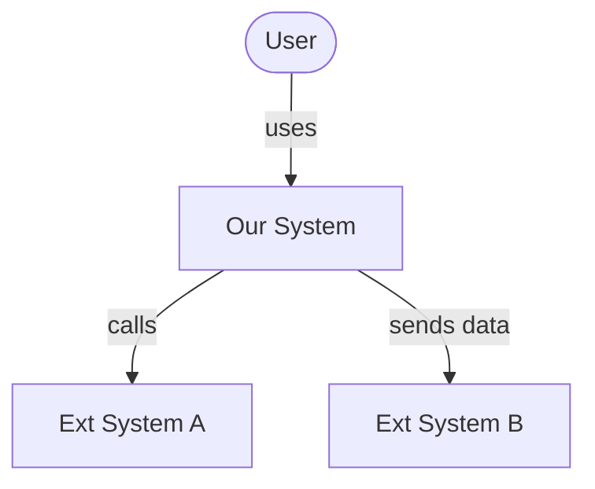
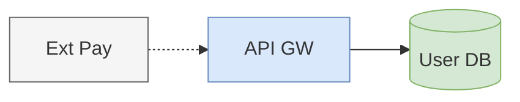
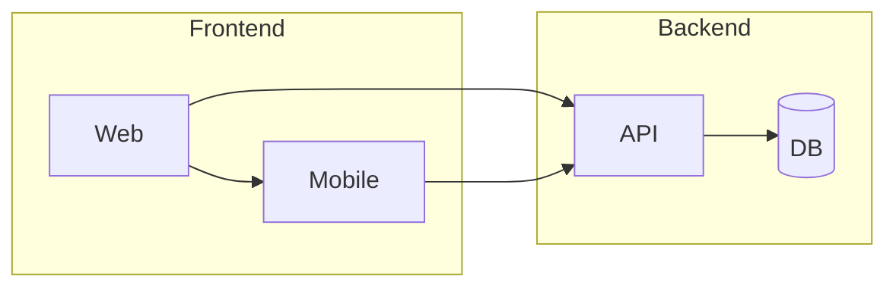
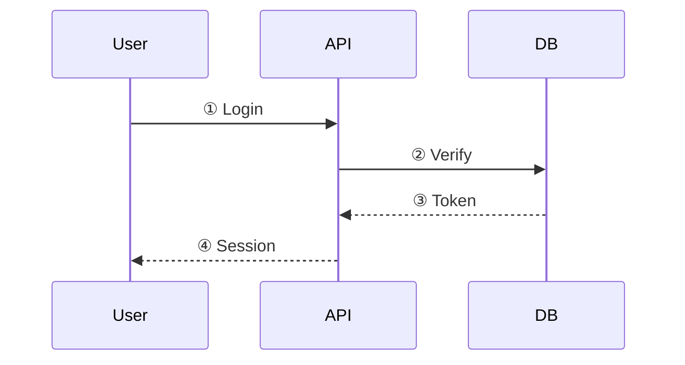

# Diagram Rules — Mermaid 작성 규칙

Phase 3에서 Mermaid 코드를 생성할 때 반드시 참조.

---

## 1. 도형 내 텍스트 규칙

### 짧게 (3-5단어 이내)
```
✅ A[Auth Svc]
✅ B[(User DB)]
✅ C{Rate > 100?}

❌ A[Authentication and Authorization Service Module]
❌ B[(User Profile and Session Database)]
```

### 긴 이름 처리
- **축약어**: Authentication → Auth, Management → Mgmt, Service → Svc
- **줄바꿈**: `A["Order<br/>Processor"]` (2줄까지만)
- **번호 매기기**: 도형에 `①`, `②` 넣고 하단에서 설명

### 용어집 (자주 쓰는 축약)
| 축약 | 원문 |
|------|------|
| Svc | Service |
| DB | Database |
| MQ | Message Queue |
| LB | Load Balancer |
| GW | Gateway |
| Proc | Processor |
| Mgr | Manager |
| Cfg | Config |

프로젝트 특화 축약어는 범례에 추가.

---

## 2. C4 모델 적용

### Level 1: System Context
- 중심: 우리 시스템 (하나의 박스)
- 주변: 사용자, 외부 시스템만
- 도형 5개 이내
- 선: "사용한다", "데이터를 보낸다" 수준



### Level 2: Container
- 중심 시스템을 분해: 웹앱, API, DB, MQ 등
- 실행 단위(deploy unit)별 하나의 도형
- 도형 10-15개
- 선: 프로토콜/포맷 표기 (REST, gRPC, SQL)

### Level 3: Component
- 특정 컨테이너 내부의 모듈/클래스
- 한 컨테이너당 하나의 다이어그램
- 도형 10-15개
- 선: 함수 호출, 이벤트 발행

### 레벨 혼합 금지
한 다이어그램에 L1 요소(외부 시스템)와 L3 요소(클래스)가 공존하면 안 됨.
L2 다이어그램에서 하나의 컨테이너를 "확대"하는 형태로 L3를 별도로 그릴 것.

---

## 3. 선(Edge) 규칙

### 스타일 의미 통일
| Mermaid 문법 | 의미 | 용도 |
|-------------|------|------|
| `-->` | 동기 호출/의존 | REST, gRPC, 함수 호출 |
| `-.->` | 비동기 메시지 | MQ, 이벤트, 웹훅 |
| `==>` | 데이터 흐름 (대량) | ETL, 배치, 스트림 |
| `--o` | 읽기 전용 참조 | 조회, 캐시 히트 |

### 라벨 규칙
- 라벨은 2-3단어: `-->|REST API|`, `-.->|event|`
- 프로토콜 또는 데이터 포맷만 표기
- 설명이 길면 번호 매기고 본문에서 설명

### 방향 통일
- 주 흐름: **왼→오** (LR) 또는 **위→아래** (TB)
- 역방향 화살표 최소화 (응답은 생략하거나 점선)
- 한 다이어그램 안에서 방향 혼합 금지

---

## 4. 색상 규칙

### 3-4색 팔레트
| 역할 | 색상 | Mermaid style |
|------|------|---------------|
| 주요 서비스 | 파란색 | `fill:#dae8fc,stroke:#6c8ebf` |
| 데이터 저장소 | 녹색 | `fill:#d5e8d4,stroke:#82b366` |
| 외부 시스템 | 회색 | `fill:#f5f5f5,stroke:#666666` |
| 강조/경고 | 주황색 | `fill:#fff2cc,stroke:#d6b656` |

### 적용 방법


### 금지
- 5색 이상 사용
- 같은 역할에 다른 색
- 색상 설명 없이 사용 (범례 필수)

---

## 5. 레이아웃 규칙

### 방향 선택 기준
| 다이어그램 성격 | 방향 | 이유 |
|----------------|------|------|
| 데이터 파이프라인 | LR | 흐름 강조 |
| 계층 구조 | TB | 상위→하위 |
| 시퀀스/시간 순서 | TB | 위→아래 시간 |
| 비교/병렬 | LR | 좌우 대칭 |

### subgraph 사용
- 논리적 그룹핑에만 사용 (2개 이상 노드)
- subgraph 안에 subgraph 중첩 1단계까지만
- subgraph 제목은 3단어 이내



---

## 6. 번호 매기기 패턴

복잡한 흐름은 도형/선에 번호를 매기고 본문에서 설명:



**흐름 설명:**
1. ① 사용자가 로그인 요청 (ID + PW)
2. ② API가 DB에서 자격 증명 검증
3. ③ DB가 JWT 토큰 반환
4. ④ API가 세션 쿠키와 함께 응답

---

## 7. 다이어그램 타입별 가이드

### Flowchart — 시스템 구조, 데이터 흐름
- `graph LR` 또는 `graph TB`
- 조건 분기: 다이아몬드 `{}`
- 루프: 점선 역화살표

### Sequence — API 호출, 사용자 인터랙션
- participant 별칭 짧게: `participant A as Auth Svc`
- alt/opt/loop 박스로 분기 표현
- 응답은 점선 `-->>>`

### Class/ER — 데이터 모델
- 필드는 핵심만 (PK, FK, 주요 속성)
- 관계선에 카디널리티 표기: `||--o{`
- 메서드는 public만, 3개 이내

### State — 상태 머신
- 상태명은 동사가 아닌 명사/형용사: `Idle`, `Processing`, `Failed`
- 전이 라벨: `이벤트 / [조건] / 액션` 형식

---

## 8. 범례(Legend) 필수 규칙

모든 다이어그램 출력 시 범례를 함께 제공:

```markdown
### 범례
| 기호 | 의미 |
|------|------|
| ── → | 동기 호출 (REST) |
| - - → | 비동기 (MQ) |
| 🔵 | 서비스 |
| 🟢 | 데이터 저장소 |
| ⬜ | 외부 시스템 |
```

범례가 없는 다이어그램은 검증 실패 처리.
