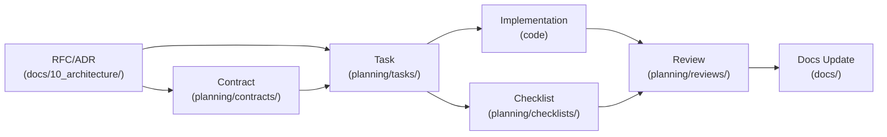

# Documentation Site Architecture (Information Architecture)

Defines the **hierarchy, numbering scheme, and governance rules** for MkDocs-based documentation sites.
`/init-docs` command initializes project docs according to these rules.

---

## 1. 3-Level Folder Hierarchy

The `00-99` numbering scheme enforces sort order. Numbers represent **categories**;
each category contains multiple Diataxis types (Tutorial / How-to / Explanation / Reference).

```
docs/
├── index.md                         # Doc home (project overview + doc map)
├── glossary.md                      # Glossary (SSOT)
│
├── 00_context/                      # Context: why this project
│   ├── index.md
│   ├── business-goals.md            # [Explanation]
│   ├── personas.md                  # [Reference]
│   ├── requirements.md              # [Reference]
│   └── glossary-guide.md            # [How-to]
│
├── 10_architecture/                 # Design: how to build it
│   ├── index.md
│   ├── system-overview.md           # [Explanation]
│   ├── tech-stack.md                # [Explanation]
│   ├── data-model.md                # [Reference]
│   └── adr/
│       ├── 001-database-choice.md
│       └── 002-auth-strategy.md
│
├── 20_implementation/               # Implementation: code-level details
│   ├── index.md
│   ├── api-reference.md             # [Reference]
│   ├── config-reference.md          # [Reference]
│   ├── cli-reference.md             # [Reference]
│   └── module-guide.md              # [Explanation]
│
├── 30_guides/                       # Guides: practical work
│   ├── index.md
│   ├── tutorials/                   # [Tutorial]
│   │   ├── getting-started.md
│   │   └── first-deployment.md
│   └── howto/                       # [How-to]
│       ├── migrate-database.md
│       ├── rotate-tokens.md
│       └── troubleshooting.md
│
├── 40_operations/                   # Operations: production management
│   ├── index.md
│   ├── deploy-guide.md              # [How-to]
│   ├── monitoring.md                # [Explanation]
│   ├── runbook.md                   # [How-to]
│   └── sla-reference.md             # [Reference]
│
└── 90_archive/                      # Archive: no longer valid
    ├── index.md
    └── ...
```

### Numbering Scheme

| Range | Category | Key Question |
|-------|----------|-------------|
| `00` | Context | **Why** this project? |
| `10` | Architecture | **How** to build it? (design) |
| `20` | Implementation | **What** was built? (code-level) |
| `30` | Guides | **How** to use it? (practical) |
| `40` | Operations | **How** to run it? (production) |
| `50-80` | (Reserved) | Project-specific extensions |
| `90` | Archive | Deprecated documents |

### Numbering vs Diataxis Mapping

Numbering = **topic (domain)** classification. Diataxis = **purpose** classification. They are orthogonal.

```
              Tutorial   How-to   Explanation   Reference
00_context       -          ●          ●            ●
10_architecture  -          -          ●            ●
20_implementation-          -          ●            ●
30_guides        ●          ●          -            -
40_operations    -          ●          ●            ●
```

Diataxis type is specified via the `type` field in YAML frontmatter.

### 3-Axis Model: Domain x Purpose x Execution

| Axis | Classification | Physical Location |
|------|---------------|-------------------|
| **Domain** (numbering) | By topic: context, architecture, implementation... | `docs/00-90_*/` |
| **Diataxis** (purpose) | By reader goal: Tutorial, How-to, Explanation, Reference | within `docs/` categories |
| **Delivery** (execution) | By workflow: Task, Contract, Checklist, Review | `planning/` |

Domain and Diataxis axes intersect within `docs/`. Delivery axis lives in a separate root (`planning/`).
**Same repo, different roots** — separates concerns while maintaining traceability.

---

## 2. MkDocs Configuration

**Theme:** `material` with navigation tabs/sections/indexes, search suggest/highlight, TOC integration, light/dark toggle.

**Required plugins:** `search`, `tags`, `git-revision-date-localized` (with `enable_creation_date: true`).

**Required extensions:** `admonition`, `pymdownx.details`, `pymdownx.superfences` (with mermaid fence), `pymdownx.tabbed`, `attr_list`, `md_in_html`, `toc` (with permalink).

**Tags:** Define allowed tags in `extra.tags` (e.g., `auth`, `database`, `api`, `infra`, `security`).

**Nav structure** mirrors the numbered folder hierarchy: Home, Glossary, Context, Architecture (with ADR sub-section), Implementation, Guides (Tutorials + How-to), Operations, Archive.

### index.md Template

Each category `index.md` serves as a **document map**:

```markdown
---
title: "[Category Name]"
tags: []
---

# [Category Name]

[2-3 sentences describing what this category covers.]

## Documents

| Document | Type | Description | Last Updated |
|----------|------|-------------|-------------|
| [System Overview](system-overview.md) | Explanation | Full architecture description | 2025-03-18 |
```

---

## 3. Five Governance Rules

### Rule 1: Single Source of Truth (SSOT)

Same information exists in **exactly one place**.

| Pattern | DO | DON'T |
|---------|-----|-------|
| API spec | Auto-generate from code, link from design docs | Copy-paste spec into design docs |
| Config values | One config reference file | Duplicate in README + guides |
| Term definitions | Define in `glossary.md`, link elsewhere | Redefine in each document |

Violation: if same info exists in 2+ places, designate one as canonical and replace others with links.

### Rule 2: Date & Status

Required frontmatter: `title`, `type`, `status`, `author`, `owner`, `created`, `updated`, `tags`, `audience`.
Lifecycle: `draft → review → published → deprecated → 90_archive/`

### Rule 3: Tagging

Tags surface cross-cutting concerns beyond folder structure. Lowercase kebab-case only (`auth`, `deploy`). Maintain an allowed list in `mkdocs.yml extra.tags` — no free-form tags.

### Rule 4: Ownership

Every document has an `owner` (GitHub handle or team). Owners: quarterly review published docs, update docs on code changes, handle deprecation, transfer ownership before leaving.

### Rule 5: Pruning

**Wrong information is worse than no information.** Triggers: quarterly review, `updated` > 6 months, deleted referenced code. Procedure: set `status: deprecated` with reason, move to `90_archive/`, record in `archive/index.md`.

---

## 4. Category index.md Template

```markdown
---
title: "[NN_CategoryName]"
---

# [Category Name]

[2-3 sentences describing this category's scope.]

## Document List

| Document | Type | Status | Owner | Last Updated |
|----------|------|--------|-------|-------------|
| [Title](filename.md) | [Type] | [Status] | [@name] | [Date] |

## Related Categories

- [Previous: XX_Category](../XX_Category/index.md)
- [Next: XX_Category](../XX_Category/index.md)
```

---

## 5. Archive Rules

`90_archive/` is a **reference library**, not a graveyard.

### archive/index.md Template

```markdown
---
title: "Archive"
---

# Archive

Documents no longer valid but preserved for reference.

## Archive List

| Document | Original Location | Reason | Date | Replacement |
|----------|------------------|--------|------|-------------|
| [v1 API Spec](v1-api.md) | 20_implementation/ | Replaced by v2 | 2025-03 | [v2 API](../20_implementation/api-reference.md) |
```

### Archived Document Header

Add `status: deprecated` to frontmatter and a warning block: replacement link, reason, archive date.

---

## 6. CI/CD Automation (Optional)

**Deploy workflow** (`.github/workflows/docs.yml`): On push to `main` (paths: `docs/**`, `mkdocs.yml`), checkout with `fetch-depth: 0`, install `mkdocs-material` + `mkdocs-git-revision-date-localized-plugin`, run `mkdocs gh-deploy --force`.

**Link validation** (`.github/workflows/docs-lint.yml`): On PR, run `mkdocs build --strict` to detect broken links.

---

## 7. Execution Document Directory (`planning/`)

`docs/` contains **reader-facing documentation**. `planning/` contains **execution artifacts for assigning, tracking, and verifying work**.
`planning/` sits outside the `00-90` numbering scheme and operates independently of Diataxis classification.

### Structure

```
planning/
├── index.md              # Overview + workflow diagram
├── tasks/                # Work orders (derived from RFC/ADR)
│   └── T-001-slug.md
├── contracts/            # Interface/schema/SLA contracts
│   └── domain-contract.md
├── checklists/           # Per-task verification lists
│   └── T-001.md
└── reviews/              # Post-completion reviews
    └── T-001-review.md
```

### Workflow



### Source of Truth Hierarchy

The source of truth is **RFC/ADR + Contract**:

1. **RFC/ADR** (`docs/10_architecture/`) — Why, alternatives, tradeoffs
2. **Contract** (`planning/contracts/`) — What is guaranteed
3. **Task** (`planning/tasks/`) — What to do (derived)
4. **Checklist** (`planning/checklists/`) — How to verify
5. **Review** (`planning/reviews/`) — Result evaluation

### MkDocs nav Integration

To include `planning/` docs in the MkDocs site:

```yaml
nav:
  # ... existing docs/ entries ...
  - Planning:
    - planning/index.md
    - Tasks:
      - planning/tasks/T-001-slug.md
    - Contracts:
      - planning/contracts/domain-contract.md
```

> Detailed rules (templates, naming, status lifecycle, linking): see `references/execution-rules.md`.
